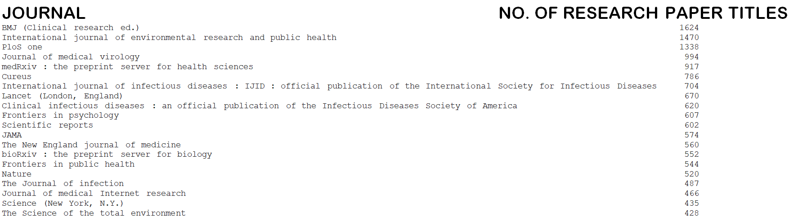

# Predicting-journal-of-publication-from-title-of-research-paper
----------------
Using LSTM to read the title of a research paper and predict which journal it was published in by a multiclass classification model with 20 journals.

The model is in the form of a notebook (model.ipynb) that can be run in Google colab directly (necessary installations included).

----------------

## Prerequisites
-------------
   - Python 3.7.10
   - PyTorch
   - Numpy/Scipy/Pandas
   
----------------

## Dataset
----------------
The dataset consists of 14898 research paper titles and the corresponding journal in which they were published as a csv file (data1.csv).

The distribution is as follows:

----------------
 ## Model
----------------
The model is an lstm for multiclass classification. We have used [BERT](https://huggingface.co/transformers/model_doc/bert.html) in this project
 
----------------
## Training DiscoGAN
----------------

Run the cells in the notebook (model.ipynb) in order.

----------------

## Results
----------------

We reached an F1 score of 0.46264328130859583 on the validation data.

----------------

## Purpose

----------------

This project is an attempt to judge if research journals are biased towards a particular kind of research papers and potentially a guide to researchers for which journal they have the highest likelihood of getting their paper published in.
